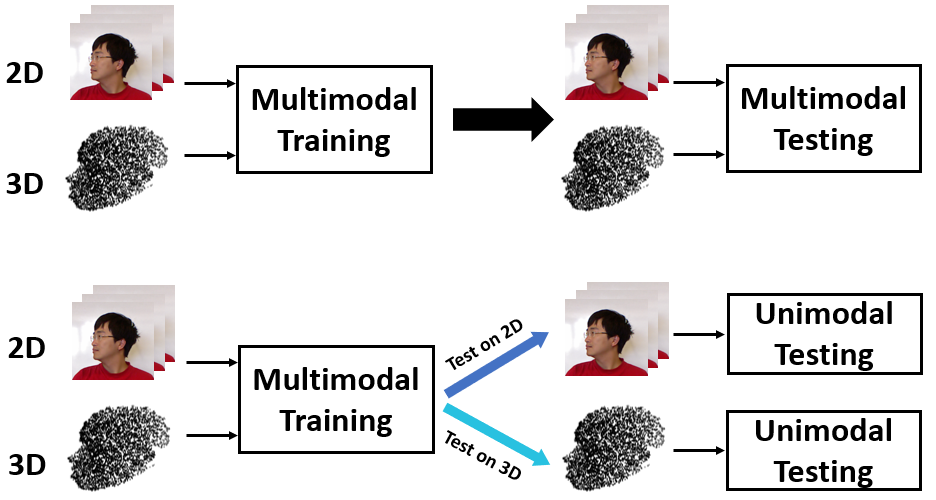

## About me

I'm a prospective graduate student major in computer science. My research interest lies at the intersection of computer vision and deep learning, especially in facial image analysis and application including face recongnition, 3D face reconstruction and face anti-spoofing. 

I graduated from Boston University with a Bachelor's degree in Statistics. During my undergraduate program, I was fortunate to conduct my research under the supervision of Prof. [Allen G. Harbaugh-Schattenkirk](http://www.longwood.edu/directory/profile/harbaughaglongwoodedu/). I have worked as a research intern with Prof. [Allan Yuille](https://www.cs.jhu.edu/~ayuille/) and Dr. [Adam Kortylewski](https://adamkortylewski.com/) at Johns Hopkins University. I am also fortunate to work with Prof. [Bernardo Cuenca Grau](https://www.cs.ox.ac.uk/people/bernardo.cuencagrau/) from University of Oxford and Dr. [Chongyang Bai](https://www.cs.dartmouth.edu/~cy/) from Dartmouth College.

## Recent News

- Oct. 2021: Our paper on Unimodal Face Classification with Multimodal Training is accepted by FG 2021

## Research

**Unimodel Face Classification with Multimodal Training**
 **Wenbin Teng**, Chongyang Bai   Accepted by _IEEE International Conference on Automatic Face and Gesture Recognition 2021_
 \[[Code](https://github.com/wbteng9526/mtut_fr)\] \[Paper(Comming Soon)\]
